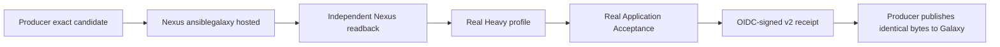

# MLX-90 collection candidate validation

This controller is the ModuLix validation boundary between the private Nexus
candidate registry and public Ansible Galaxy. It applies only to a qualified
MLX-90 Security release. Normal releases retain their human approval from
`develop` to `main` and do not enter the zero-touch authorization path.

The active controller is:

```text
.github/workflows/mlx90-collection-candidate-validation.yml
```

It accepts only an App-dispatched canonical v2 request for the exact
`lightning-it/ansible-collection-supplementary` source run and protected
ModuLix `main` SHA. A user dispatch, a mutable ref, another installation,
another repository, a non-MLX90 evidence ID, or a changed permission matrix is
rejected before Nexus credentials are read.

## Delivery boundary



The Nexus readback job never rebuilds the collection. It downloads the exact
native Galaxy-v3 artifact URL, rejects redirects, verifies the expected byte
count and SHA-256, checks the bounded collection archive and `MANIFEST.json`,
and proves that dependency preparation did not change the candidate. Both
profiles receive the same workflow artifact containing that candidate.

The profile matrices are generated from the exact Producer commit's
authoritative `meta/role-coverage.yml`. For the Golden Path they must contain a
non-empty supported Heavy matrix and a non-empty supported Application
Acceptance matrix. A skipped or failed cell prevents receipt creation.

## Identity and least privilege

The live installation contract is:

| Field | Exact value |
| --- | --- |
| App slug | `lightning-it-release-automation` |
| Installation ID | `148019054` |
| Organization | `lightning-it` |
| Repository selection | `selected` |
| Installation permissions | Actions write; Checks read; Contents write; Metadata read; Pull requests write |
| Absent permissions | Workflows, Deployments, administration, environments, secrets, branch protection |

Each source token is further reduced to `Contents: read` for only
`lightning-it/ansible-collection-supplementary`; the validation token also has
`Actions: read` only while reading the exact Producer run. No personal access
token is used by this MLX-90 path.

The workflow is bound to the protected, reviewer-free
`mlx90-security-candidate-validation` Environment and protected `main` ref.
That Environment provides references to the following nonsecret variables and
secret values:

| Kind | Name | Purpose |
| --- | --- | --- |
| Variable | `RELEASE_AUTOMATION_APP_CLIENT_ID` | Approved GitHub App client identity |
| Secret | `RELEASE_AUTOMATION_APP_PRIVATE_KEY` | Short-lived token minting; never evidence |
| Variable | `NEXUS_GALAXY_REPOSITORY` | Exact native `ansiblegalaxy` hosted repository name |
| Variable | `NEXUS_GALAXY_REPOSITORY_URL` | Credential-free HTTPS repository URL |
| Secret | `NEXUS_GALAXY_USERNAME` | Least-privilege candidate reader |
| Secret | `NEXUS_GALAXY_PASSWORD` | Candidate reader credential |

The environment must have no required reviewers and must allow only the
protected `main` branch. The Incus runner must be supplied through the
declarative ephemeral runner controller with at least
`self-hosted`, `linux`, `x64`, `incus`, and `keycloak-test` labels. A manually
registered or manually approved runner is not acceptance evidence.

Nexus must run version 3.93.1 or later with the `AnsibleGalaxyToken` realm and
a native hosted `ansiblegalaxy` repository. Version 3.93.1 is the minimum
because it contains the initial hosted Ansible Galaxy correctness fixes. The
workflow performs no repository creation, credential provisioning, or policy
bypass; those are declarative platform and Governance prerequisites.

## Signed receipt

Only a run in which request validation, Nexus readback, every Heavy cell and
every Application Acceptance cell succeed creates the artifact
`mlx90-collection-validation-<request-id>`. It contains exactly:

- `mlx90-collection-validation-receipt.json`;
- `mlx90-collection-validation-receipt.json.sigstore.json`.

The canonical receipt binds the exact request, source run, controller run,
candidate digest, App actor, run attempt and successful profile observations.
Cosign signs it through GitHub OIDC under the protected controller workflow
identity. The Producer independently verifies that signature, the completed
run and every required job before it may publish the unchanged candidate to
Galaxy.

The receipt's local `humanActions: 0` claim proves that this dispatch and its
validation jobs needed no human action. It does not replace the lifecycle-wide
v2 human-action collector. Final acceptance remains blocked until that
collector independently measures zero across promotion, environments, PRs,
merges, publication, back-sync, container delivery and finalization.

## Local verification

Run the deterministic contract checks before publishing a change:

```bash
python3 -m unittest tests.test_mlx90_collection_candidate_validation -v
yamllint .github/workflows/collection-quality-profile.yml \
  .github/workflows/mlx90-collection-candidate-validation.yml
git diff --check
```

The clean committed candidate must then pass
`scripts/lit-ci-profile.sh repository-quality` and the repository's
history-free push-ready review. No live success may be claimed until the
protected workflow completes on the real Incus runner against the configured
Nexus candidate registry.
